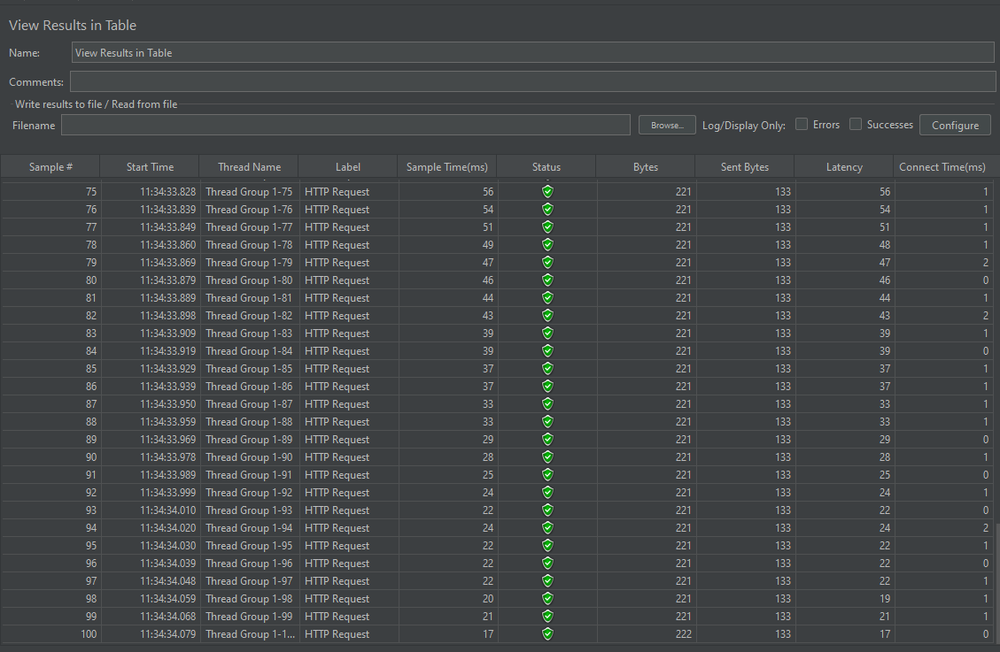

# 동시성 테스트

---

## 1. 조회수 테스트

### 시나리오

```text
- 게시글을 상세 조회하면 조회수가 1증가한다.
- 100명이 한 게시글을 조회하면 조회수가 100이 되어야한다.
```

### Case1


#### Service
```java
@Transactional
public PostResponseDto getPost(Long id) {
    Post post = postRepository.findById(id)
        .orElseThrow(IllegalArgumentException::new);

    post.increaseView();

    return new PostResponseDto(post);
}
```


```text
100건의 요청이 발생하였지만 누락되어 39건의 조회수를 확인할 수 있음.
```

### Case2

#### Service
```java
@Transactional 
public PostResponseDto getPost(Long id) {
    Post post = postRepository.findById(id)
        .orElseThrow(IllegalArgumentException::new);

    postRepository.increaseViewCount(post.getId());

    return new PostResponseDto(post);
}
```

#### Repository
```jpqlcommunity
@Modifying
@Query("UPDATE Post p SET p.views = p.views + 1 WHERE p.id = :id")
int increaseViewCount(Long id);
```


```text
Update 쿼리를 사용하여 해결
```

### Case3

#### Service
```java
@Transactional
public PostResponseDto getPost(Long id) {
    Post post = postRepository.findById(id)
    .orElseThrow(IllegalArgumentException::new);

    post.increaseViewCount();

    return new PostResponseDto(post);
}
```

#### Repository
```jpqlcommunity
@Lock(LockModeType.PESSIMISTIC_WRITE)
Optional<Post> findById(Long id);
```





```text
- 비관적 Lock으로 해결(exclusive lock)
    - `Select For Update` 쿼리를 확인할 수 있었음.
```

### 생각

```text
- 낙관적 락이 성능상 이점이 있지만, 경합이 빈번한 경우에는 비관적 락이 좋음.
    - 또한 조회수에는 적절하지 않음.
- 조회수를 Redis에서 캐싱하고, DB로 write back
    - 성능 개선은 확실하나, 조회수가 중요한 비즈니스가 아니라면 비용적으로 낭비가 아닐까?
    - 반영하는 동안 들어오는 요청이 누락될 수 있어서 해결해야함
- 게시글 노출 분리하기
    - 인기글(추천글), 일반 게시글
- 적절한 주기로 인기글을 올린다면.. 가령 1일
```

---

## 2. 선착순 쿠폰 발급

### 시나리오


```text
- 위의 사진처럼 선착순 100명에게 쿠폰을 발급한다.
    - 쿠폰이 100장이상 발급되면 안된다.
```

### [Case1](https://github.com/Hannah0su/concurrency-test/commit/74e5f8420ff66df8abf5882e0f09e8a355dc5a85)

```text
- 경합 조건 발생(Race Condition)
    - 다수의 스레드가 같은 공유자원(쿠폰)에 접근하면서 데이터 정합성이 맞지 않게 됨
```
### [Case2](https://github.com/Hannah0su/concurrency-test/commit/9c33b21c409a091bfb0e076a9e8cac235f4707a5)

```text
- Redis의 incr을 통해서 해결
    - 100건이 아닌 많은 양의 쿠폰을 발급할 때 DB에 부하가 클 수 있음.
    - DBCP도 고려해봐야함
```

### [Case3](https://github.com/Hannah0su/concurrency-test/commit/622320613bc9cf79a5978fc5fffa4f9c13a6d23e)

```text
- Kafka를 이용하여 해결
    - 쿠폰 생성 작업의 분리
    - 처리량 조절을 통해 DB에 발생하는 부하를 줄일 수 있음
```

---
